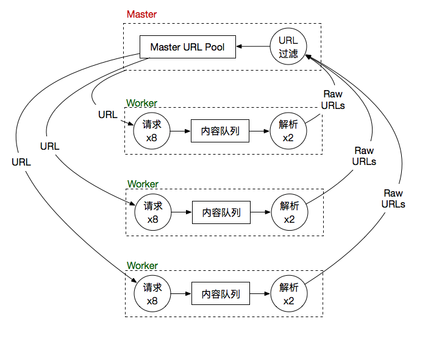
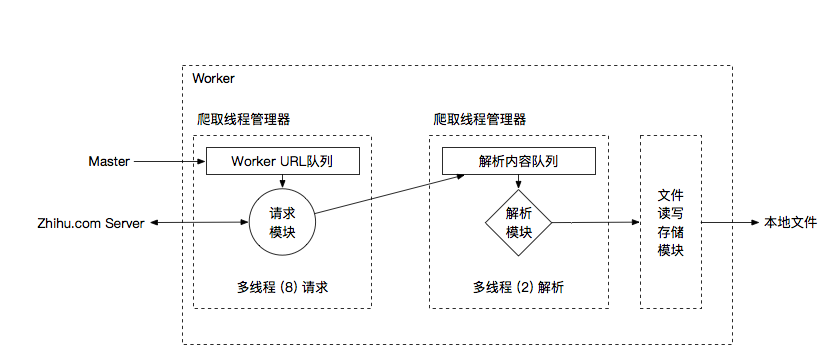
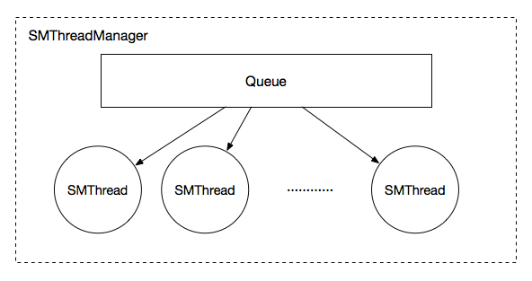
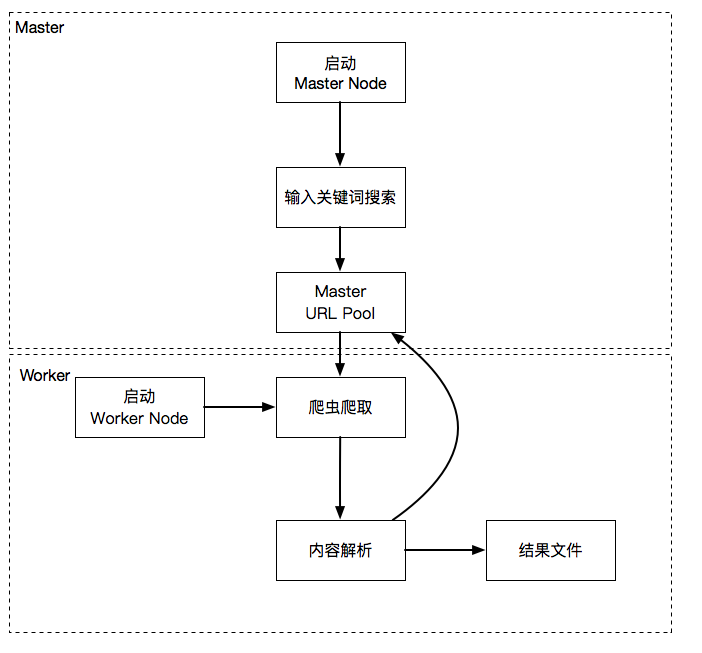

# SpiderMan
Spiderman is the god

### Introduction

**2017~2018 软件课程设计--知乎爬虫**

* 简易的分布式爬虫(使用multiprocessing和queue实现)

* Selenium获取网页，解决网页动态加载问题

* PyTorch情感分析模型

### Architecture

#### **Distributed Version**



##### Master

* URL Pool
* URL Filter (Based on BloomFilter and Regex, to remove duplicates or illegal urls)

##### Worker



* Request with URLs from Master Node (Based on selenium and phantomjs webdriver)
* Parse the html content (questions, answers, topics, people) 
* Save the parsed content to local storage.

#### Thread Manager



* 使用Queue和threading封装线程池。

--- 

### Runing Process



----

### Usage

````python

# run distributed version
# start master 
python master.py
# start worker
python main.py

# run single version
python master.py

````

### Licence

This project is under the **MIT** licence
